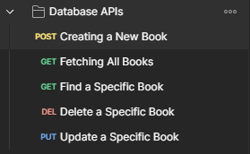

# 📚 Bookstore REST API

     

---

## 📑 Table of Contents

- [📚 Bookstore REST API](#-bookstore-rest-api)
  - [📑 Table of Contents](#-table-of-contents)
  - [📌 Introduction](#-introduction)
  - [🚀 Features](#-features)
  - [📂 Project Structure](#-project-structure)
  - [🔗 Technologies Used](#-technologies-used)
  - [📡 API Endpoints](#-api-endpoints)
  - [📸 Postman Testing Screenshots](#-postman-testing-screenshots)
  - [📦 Installation \& Run Locally](#-installation--run-locally)
  - [📄 License](#-license)

---

## 📌 Introduction

This is a **Node.js RESTful API** for managing a bookstore. It allows you to perform **CRUD operations** (Create, Read, Update, Delete) on books using **MongoDB** as the database. The purpose of this project was to understand backend folder structure and follow clean coding practices.

---

## 🚀 Features

- 📝 Add new books
- 📖 Retrieve all books or by ID
- 🔄 Update book details
- ❌ Delete books
- 🌐 Connected with MongoDB
- 📫 Tested thoroughly using Postman
- ♻️ Auto-restart server using `nodemon`

---

## 📂 Project Structure

```md
project_bookstore_api_development/
│
├── controllers/
│ └── book_controller.js # Business logic for books
│
├── models/
│ └── Book.js # Mongoose schema for books
│
├── database/
│ └── db.js # MongoDB connection setup
│
├── routes/
│ └── book_routes.js # All route definitions
│
├── .env # Environment variables
├── server.js # Main entry point
└── package.json # Project metadata and dependencies
```

---

## 🔗 Technologies Used

| Category    | Tools             |
| ----------- | ----------------- |
| Server      | Node.js, Express  |
| Database    | MongoDB, Mongoose |
| Runtime     | Nodemon           |
| Testing     | Postman           |
| Environment | dotenv            |

---

## 📡 API Endpoints

| Method | Endpoint                   | Description         |
| ------ | -------------------------- | ------------------- |
| GET    | `/api/book/fetchAllBooks`  | Get all books       |
| GET    | `/api/book/getBook/:id`    | Get a book by ID    |
| POST   | `/api/book/createBook`     | Create a new book   |
| PUT    | `/api/book/updateBook/:id` | Update a book by ID |
| DELETE | `/api/book/deleteBook/:id` | Delete a book by ID |

---

## 📸 Postman Testing Screenshots

> _Below are some screenshots from my Postman testing environment:_

| CRUD API Testing Using Postman          |
| --------------------------------------- |
|  |

---

## 📦 Installation & Run Locally

```bash
# 1. Clone the repo
git clone https://github.com/Aaditya-Kumar-Mittal/project_bookstore_api_development.git
cd project_bookstore_api_development

# 2. Install dependencies
npm install

# 3. Create a `.env` file
touch .env
# Add your MongoDB connection string
# MONGO_URI=mongodb+srv://<username>:<password>@cluster0.mongodb.net/bookstore

# 4. Start the server
npm run dev
```

---

## 📄 License

This project is open-source and available under the [MIT License](LICENSE).
